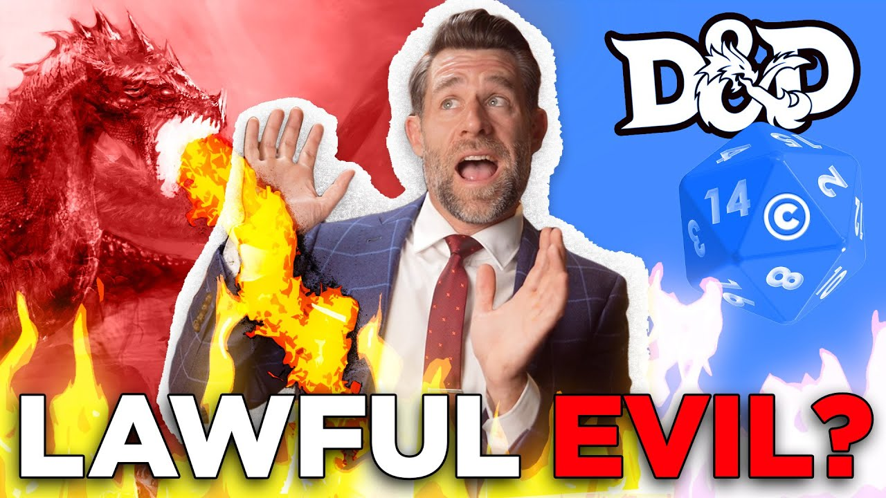

# Not DnD 5thSRD

The following is NOT a copy of the DnD 5th SRD.

It is a creative expression, of a common set of rules, for another realm. That is losely compatible with the rules of Dungeon and Dragons.

This is built using the collabrative effort, of human's and AI.

Almost everything is in the [docs folder](./docs/)

# For example, here is the rules on "Taking rest"

**Not DnD 5thSRD**

> **Taking Rest**
>
> Though they may be brave and courageous, adventurers cannot spend every hour of the day in the midst of exploration, social interaction, and combat. They must take time to rest, to sleep and eat, to tend to their wounds, to refresh their minds and spirits for spellcasting, and to prepare themselves for further adventures.

**Extract from a major game**

> **Resting**
>
> Heroic though they might be, adventurers can't spend every hour of the day in the thick of exploration, social interaction, and combat. They need rest--time to sleep and eat, tend their wounds, refresh their minds and spirits for spellcasting, and brace themselves for further adventure.

It maybe similar, but the wording is different.

# this @LegalEagle video link is here for no reason in particular

https://youtu.be/iZQJQYqhAgY?t=373

I like this video, and you should see it 😉

# How was this made?

I have gotten OpenAI GPT3.5 (aka chatGPT), to write every page, in its own "flare".

This is done with either of the following techniques
- Given inspiration materials, asked it to rewrite the rules in a different style and format
- After finetuning with the various source materials, asked it to write the rules for individual spells, characters, classes, etc

The specific's of which page is done using which method, will not be disclosed. I will regenerate the pages if required, for the method that is more "legal friendly".

The process is entirely automated, as such as a human, I have to properlly edit and proof read all 973 documents that were generated.

PS: It took over 4 hours, for the AI to rewrite every page, one page at a time. Which I had to do about 3 times, due to silly coding bugs on my end.

# Terms list

For the sake of avoiding confusion, with another well known game franchise.

The following are clarification, for common confusion, with potentially copyrighted or trademark terms.

| Terms we use | Terms, that some people may confused with | Source Materials for our terms |
| --- | --- | --- |
| Game Master | Dungeon Master | https://en.wikipedia.org/wiki/Gamemaster |
| Realms | Planes | https://en.wikipedia.org/wiki/Multiverse |
| Blindvision | Blindsight | https://en.wikipedia.org/wiki/Blindsight |
| Darksight | Darkvision | https://en.wikipedia.org/wiki/Night-vision_device |
| Truevision | Truesight | https://en.wikipedia.org/wiki/Eagle_eye |
| Baluran Gate | Baldur's Gate | https://en.wikipedia.org/wiki/Baluran_National_Park |
| Waterhelm | Waterdeep | https://lotr.fandom.com/wiki/Helm%27s_Deep | 
| Sea Horror | Aboleth | https://en.wikipedia.org/wiki/Sea_monster | 

Note that the above is a limited list.
The full (work in progress) list will be [updated here](./terms/full-terms-list.md)

# Is this legal, what is the license for this?

Honestly I do not know - I intend to put this under `MIT license`. But I do not know If I can.

This combines 2 giant legal furball.

- copyright vs trademark [See legal eagle full video](https://www.youtube.com/watch?v=iZQJQYqhAgY&ab_channel=LegalEagle)
    - We would need to adapt all of this, to ensure it does not trip over any trademarked term
    - Our best approach, is to ensure all terms used, has origins from history (outside D&D, or use alternative terms)
- Is an AI output copyrightable? This question is up in the air for the legal community!
    - I proposed a possible solution to [treat AI models and output as derivative works of their previous steps here](https://substack.tech-talk-cto.com/p/how-opensource-style-licensing-can)
    - Specifically in this case
        - if an AI model was used to transform copyright materials, what is the copyright of the output?
        - if an AI model was trained via fine tuning on copyright materials, and rewrites the output with some prompting, what is the copyright of the output? 

You can see my article for way too much details on the AI issue : https://substack.tech-talk-cto.com/p/how-opensource-style-licensing-can

So until those are resolved, treat this as a dump of various WIP stuff.

If this is considered derivative work, it would be probably using the something like the OGL license
If this is NOT derivative work, it would be MIT license.

Also to make it clear in advance, if anyone is willing to "take legal responsibility", of converting this to MIT licensing.
I will not be persuing you, as long as you give attribution to this project (and its other contributors), as per the spirit of the MIT terms.

I am not a lawyer

# So what can we do next to make this MIT license compatible ?

- Step 1) Review and remove any trademark / copyright infringing term.
    - The AI draws inspiration from too many sources, including copyright / trademark infringing sources.
    - The goal of this project, is to ensure all source materials, and terms, can be drawn on a common public domain heritage (eg. wizards is a noncopyrightable term, so is elves), that is free of copyright and trademark.
    - Rule of thumb, if you find the term used in 1800s literature (or earlier), we can use that as the source
    - Update the terms table accordingly (we might need to make this a seperate document)
    - To aid this process, the docs was scanned against an npm dictionary `word-list`, with unique words listed [in terms/unique-words.txt](./terms/unique-words.txt)
    - Also we must, have a human author edit every page, with atleast 20% changes.
        - This allows us to assert that atleast, the human authors changes are copyrightable under MIT licensing (until we have an answer regarding AI and copyright)

- Step 2) Cleanup and fix any formatting issues in the various documents.
    - GPT had limits, as such I had to splt up chunks part by part, these may cause formatting issues within the same document
    - We should do a sentence to sentence check, that no sentence is copied directly from existing copyright materials.

- Step 3) Make it builder-ble into a website / PDF format like : https://github.com/vitusventure/5thSRD

- Step 4) Get the blessings of a lawyer? That we are good to go?
    - Hell, does this technically count as parody?

Once all these are resolve, maybe we would want to call it `OpenSRD` ?

# Terms for pull requests

If you pass me any pull requests, you release all your copyright claims and licensing terms for your changes.
I will keep your changes in git history, and ensure your changes are tracked as a contributor.

If the end result can be MIT licensed. You will be named as a contributor attributed under the MIT license.
If the end result is considered derivative work, it should be under OGL, and you have git history and credit. (Need a lawyer)

# More food for thought

You may want to consider the following, video - from a smaller D&D themed channel, regarding OGL

https://www.youtube.com/watch?v=8X8BS-2lP1s&ab_channel=ZoranTheBear

---

# Like what I am doing?

I am Eugene from [Uilicious.com](https://uilicious.com) and I go by the online handle of @picocreator

- Consider signing up to my substack newsletter : [https://substack.tech-talk-cto.com/](https://substack.tech-talk-cto.com/)
    - Random topics regarding AI, engineering, and startup.
- Or support my small startup : [https://uilicious.com](https://uilicious.com)
    - an easy to use low-code website testing tool, with AI !
    - useful, for constantly testing your website, for you !

